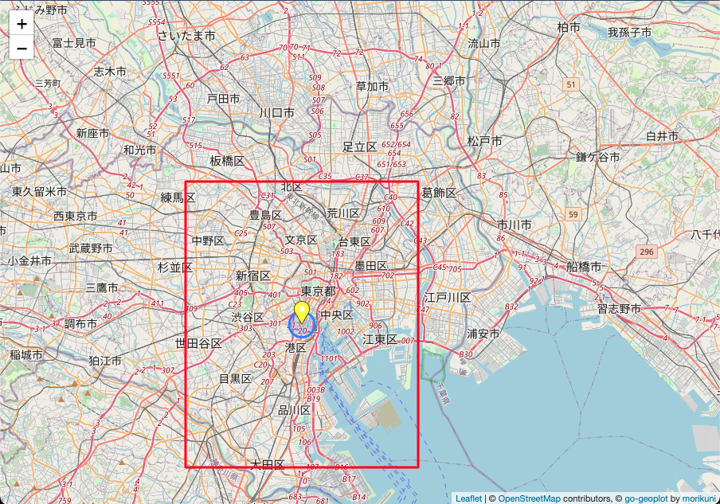

# go-geoplot

Plot geographical data on a map in Go.

## Example

```go
package main

import (
	"fmt"
	"image/color"
	"net/http"

	"github.com/morikuni/go-geoplot"
)

func main() {
	tokyoTower := &geoplot.LatLng{
		Latitude:  35.658584,
		Longitude: 139.7454316,
	}
	icon := geoplot.ColorIcon(255, 255, 0)

	m := &geoplot.Map{
		Center: tokyoTower,
		Zoom:   7,
		Area: &geoplot.Area{
			From: tokyoTower.Offset(-0.1, -0.1),
			To:   tokyoTower.Offset(0.2, 0.2),
		},
	}
	m.AddMarker(&geoplot.Marker{
		LatLng:  tokyoTower,
		Popup:   "Hello\nWorld",
		Tooltip: "Hello",
		Icon:    icon,
	})
	m.AddPolyline(&geoplot.Polyline{
		LatLngs: []*geoplot.LatLng{
			tokyoTower.Offset(-0.1, -0.1),
			tokyoTower.Offset(-0.1, 0.1),
			tokyoTower.Offset(0.1, 0.1),
			tokyoTower.Offset(0.1, -0.1),
			tokyoTower.Offset(-0.1, -0.1),
		},
		Popup: "World",
		Color: &color.RGBA{0xff, 0, 0, 0},
	})
	m.AddCircle(&geoplot.Circle{
		LatLng:      tokyoTower,
		RadiusMeter: 1000,
		Tooltip:     "Circle of life",
	})
	err := http.ListenAndServe(":8080", http.HandlerFunc(func(w http.ResponseWriter, r *http.Request) {
		err := geoplot.ServeMap(w, r, m)
		if err != nil {
			fmt.Println(err)
			w.WriteHeader(http.StatusInternalServerError)
		}
	}))
	fmt.Println(err)
}
```

